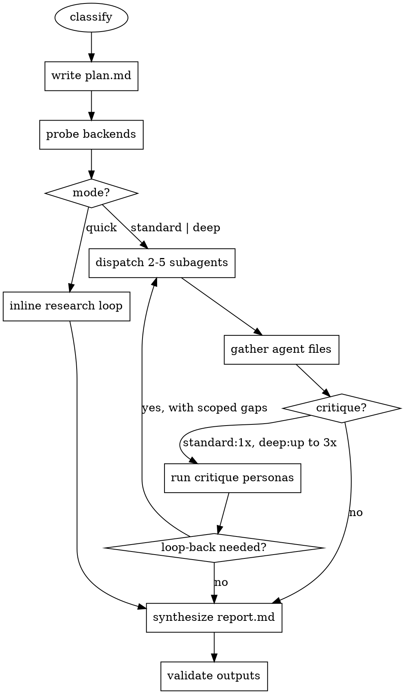

# Deep Research

## Overview

**Core principle: evidence before synthesis; skeleton before search; critique before done.**

This skill produces cited, synthesized research reports by dispatching parallel
subagents against scoped sub-questions, persisting evidence to disk, and
running a red-team critique pass before declaring a report complete. It adapts
its depth to the query — factoids get a 3-minute answer; landscape reviews get
30 minutes, a claim ledger, and a 3-persona critique loop.

## When to use

- "Research X", "survey the state of X", "compare X vs Y vs Z"
- "What's known about X?", "literature review on X"
- "Write a report / briefing / landscape on X"
- Multi-source questions that require synthesis (not just lookup)

## When NOT to use

- Single-fact lookup (use `WebSearch` directly)
- Code generation or refactoring
- Questions about files in the current repo (use `Grep`/`Read`)

## Mode classifier — run this first

```bash
node scripts/classify.js "<user query>"
```

Returns JSON with `mode`, `score`, `ambiguous`, `reason`, `explicit`.

Apply the result:

| classifier output | action |
|---|---|
| `mode` = quick/standard/deep, `ambiguous` = false | proceed in that mode |
| `ambiguous` = true, `AskUserQuestion` available | ask ONCE (scope + depth + time budget), then commit |
| `ambiguous` = true, `AskUserQuestion` unavailable | proceed as `standard` and note ambiguity in `plan.md` |

Full decision tree: `references/classifier-heuristics.md`.

Never re-classify or re-ask mid-run.

## Host detection

Detect the host by available tool names:

- `Task` tool present → Claude Code. Dispatch parallel research subagents via `Task`.
- `agent` / `subtask` tool present → opencode. Use its dispatch primitive.
- Neither → degraded mode: run the subagent contract yourself in the main loop.

Full detail: `references/host-detection.md`.

## Backend detection

Before dispatch, probe for MCP search backends and build a precedence list:

```bash
bash scripts/probe_backends.sh
```

Precedence (first available wins): `Exa → Tavily → Perplexity → Firecrawl → Brave → WebSearch`.

`WebFetch` is always used for page retrieval. No MCP is required.

Full detail: `references/backend-detection.md`.

## Mode bars

| Mode | Time | Sources | Subagents | Critique | Evidence ledger |
|---|---|---|---|---|---|
| quick | ~3 min | 3–6 | 0 (inline loop) | none | no |
| standard | ~10 min | 10–20 | 2–3 parallel | 1 pass | no |
| deep | ~25+ min | 20–40 | 4–5 parallel | up to 3 loops | yes (`evidence.jsonl`) |

## Workflow



## Output layout

Create `research/<slug>-<YYYY-MM-DD>/` where `<slug>` is
`scripts/slugify.sh "<query>"`. Contents:

- `plan.md` — classifier output, chosen mode, scope plan, sub-questions
- `report.md` — primary output, inline-cited
- `sources.json` — dedup'd URL list with fetch status
- `evidence.jsonl` — (deep only) one JSON claim+source+quote per line
- `agents/agent-<n>.md` — per-subagent workstream file
- `agents/agent-<n>.heartbeat` — parent reads this to detect stuck subagents

Schemas: `references/output-schemas.md`.

## Subagent contract

Paste the template from `references/subagent-contract.md` verbatim when
dispatching. The contract enforces:

1. **Skeleton first** — create `agents/agent-<N>.md` with H1 + H2 sections *before* any search call.
2. **Strict write-after-search** — one search → WebFetch → write findings → update `sources.json`. Never batch.
3. **Inline-URL citations only** — every factual claim ends with `([source](https://url))`.
4. **Scope fence** — sibling scopes forbidden.
5. **Heartbeat file** — after each write, append a line to `agents/agent-<N>.heartbeat`.
6. **Return summary + path**, not full findings.

## Stuck-agent detection

Parent polls each `agents/agent-<N>.heartbeat` file. If a subagent's line count
and source count are unchanged across two consecutive 60s checks → kill and
relaunch with partial data pre-loaded. Full protocol:
`references/stop-conditions.md`.

## Flags (user-exposed)

- `--quick` / `--standard` / `--deep` — force a mode, bypassing classifier.
- `--approve-outline` — (deep only) pause after phase-1 plan and wait for user approval before dispatching subagents. Weizhena-style gate.
- `--no-quotes` — skip verbatim quotes in `evidence.jsonl` (privacy/proprietary sources).
- `--max-spawns=N` — cap total subagent spawns; default 1/10/30 by mode.

## Critique (standard: 1 pass; deep: up to 3 loops)

Three personas run in parallel on `report.md` draft + `evidence.jsonl`:

- **Skeptical Practitioner** — primary-vs-secondary, freshness, causation.
- **Adversarial Reviewer** — must surface source disagreements; flags suppressed counter-positions.
- **Implementation Engineer** — are recommendations specific enough to execute?

**Loop back (deep only) if:** any persona flags a `MISSING` load-bearing claim,
or `report_suppresses=true`, or `evidence.jsonl` has <2 primary sources per H2.
Hard cap 3 iterations. Same gap twice → move to "Known Limitations" instead
of looping.

Persona prompts: `references/critique-personas.md`.

## Stop conditions

See `references/stop-conditions.md` for per-mode minimum sources, coverage
checklist, time budgets, and stuck-agent rules.

## Red flags — stop if you think any of these

| Rationalization | Reality | What to do |
|---|---|---|
| "Sources agree, skip critique" | Critique exists to find what's *missing* too, not just verify. | Run all three personas anyway. |
| "This claim is obvious, no cite needed" | Obvious to you ≠ obvious to reader. | Cite it. If you can't, you don't know it. |
| "I'll research more later" | Later = never. Write-after-search protocol exists for this. | Write what you have now, then search again. |
| "I have enough sources" | Enough for whom? Check `mode bars` min-source count. | Don't stop early just because narrative feels complete. |
| "The user clearly wants deep" | Respect explicit overrides. `--quick` means quick. | Honor the override. Add a "see also" note if scope feels small. |
| "MCP isn't installed, recommend they install Exa" | Skill must work with `WebSearch` alone. | Use `WebSearch` silently. |

## Quick reference

Run the skill:
1. `node scripts/classify.js "$QUERY"` → mode
2. Ambiguous? `AskUserQuestion` once.
3. Create `research/<slug>-<date>/`, write `plan.md`.
4. `bash scripts/probe_backends.sh` → pick search tool.
5. Quick: run inline loop. Standard/deep: dispatch subagents.
6. Gather agent files. Run critique (personas).
7. Synthesize `report.md` with inline URL citations.
8. `node scripts/validate_outputs.js research/<slug>-<date>/`.
