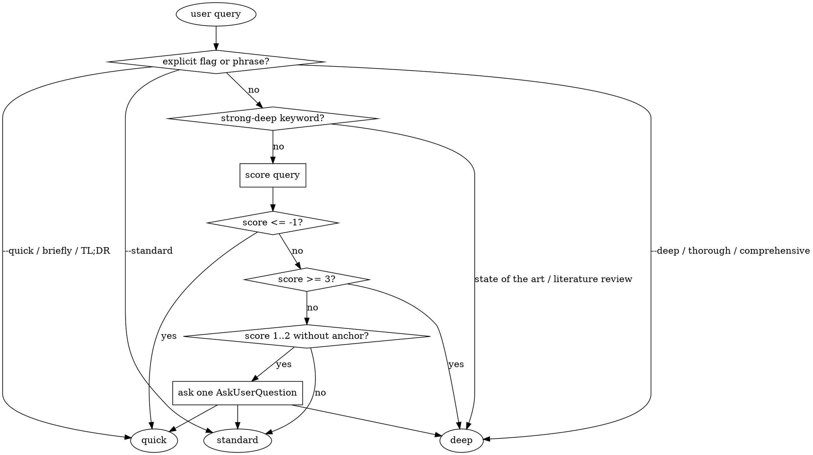

# Classifier heuristics

The mode classifier runs first, every time. It looks at the user's query and
returns one of `quick`, `standard`, or `deep` with a score and a reason.

**Implementation:** `skill/scripts/classify.js` (pure function, callable as CLI).

## Decision order

## Scoring

Start at `0`. Apply every rule that matches.

| Signal | Keywords / pattern | Delta |
|---|---|---|
| Short query | ≤ 8 words | −2 |
| Long query | > 20 words | +1 |
| Factoid (per hit) | "what is", "what's", "define", "current version", "who is", "when did", "when was", "release date", "latest version", "definition of" | −2 each |
| Breadth — comparison (max once) | compare, comparison, vs, versus, tradeoffs, pros and cons | +2 |
| Breadth — landscape (max once) | landscape, survey, ecosystem, state of, overview of | +2 |
| Breadth — options (max once) | options for, alternatives to | +2 |
| Depth (per hit) | history, evolution, benchmark, evaluate, evaluation, citations, academic, paper, research, investigate, analyze, analysis | +1 each |
| Enumeration | 2+ commas (proxy for 3+ item list) | +1 |

**Thresholds:**

- `score ≤ -1` → `quick`
- `-1 < score < 3` → `standard` (default)
- `score ≥ 3` → `deep`

## Explicit overrides (highest priority)

Match any of these → skip scoring, go directly to the mode.

- **quick:** `--quick`, "briefly", "just a quick", "quick look/check/peek", "TL;DR", "one-liner"
- **deep:** `--deep`, "deep dive", "thoroughly", "exhaustive", "comprehensive", "full report/survey/landscape", "literature review"
- **standard:** `--standard`

## Strong-deep auto-jump

These phrases auto-route to `deep` without scoring:

- "state of the art"
- "state of the field"
- "historical evolution"

Extend this list in `skill/scripts/classify.js` (`STRONG_DEEP_KEYWORDS`).

## Ambiguity rule

When the score lands in **1..2** and the query has **no strong anchor** (no
proper noun and no quoted phrase), the caller must ask exactly one
`AskUserQuestion` offering `quick` / `standard` / `deep` plus a free-text
scope refinement field. Then commit — never re-ask mid-run.

If `AskUserQuestion` is unavailable (scripted runs, CI), default to
`standard` silently and log the ambiguity in `plan.md`.

## Worked examples

| Query | Score breakdown | Mode |
|---|---|---|
| "What is the current stable version of Bun?" | short −2, factoid ×2 −4 | quick (−6) |
| "briefly, what does CORS stand for?" | explicit quick | quick |
| "Compare Tavily vs Exa vs Brave for agent search" | comparison +2 | standard (2) |
| "overview of Rust async runtimes in 2026" | landscape +2 | standard (2) |
| "state of the art in AI code review tools" | strong-deep | deep |
| "Research CRDT benchmarks across JSON, text, and tree structures" | depth ×2 +2, enum +1 | deep (3) |
| "Analyze the evolution of bundlers from Webpack to esbuild to Bun…" | comparison +2, depth ×3 +3, long +1 | deep (6) |
| "Rust" | short −2 | quick (−2) |

## Tests

See `tests/classifier/classifier.test.js` for 30+ canonical cases and property
tests. Run `make test-classifier`.
